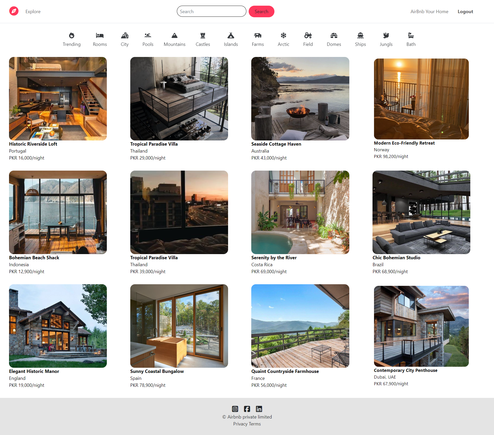

# AirBnb-Full-stack-clone

# Project Overview
This project is a full-stack website inspired by Airbnb, allowing users to:

- Browse listings: Explore various listings offered by hosts.
- View details: Access detailed information about each listing, including pictures, location, amenities, and host description.
- Create listings: Become a host by adding your own listings with descriptions, photos, and availability details.
- Edit and delete listings: Manage your listings by editing information or removing them.
- User accounts: Register for an account, log in, and log out.
- Reviews: Add and delete reviews for listings you've stayed in (assuming review functionality is implemented).
- Map view: Locate all available listings on a map using Mapbox.

# Technologies Used

 # Frontend:

- HTML
- CSS
- JavaScript

 # Backend:

- Node.js
- Express.js (or another suitable framework)

# Database:

- MongoDB

# Image storage:

- Cloudinary

# Mapping:

- Mapbox

# Features
- User authentication: Secure sign-up, login, and logout functionalities.
- Listing management: Create, edit, and delete listings with comprehensive details.
- Review system: Enable users to leave reviews for listings they've stayed in.
- Interactive map: Display listings' locations on a user-friendly Mapbox map.

# Contributing
Open to contributions and suggestions

